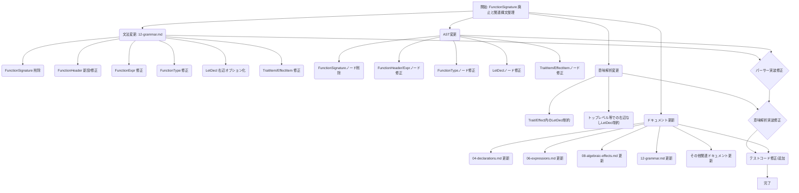

# FunctionSignature 廃止と関連構文の整理計画

## 1. 背景と目的

現在の Protorun 言語仕様では、関数定義のための `FunctionExpr` と、Trait/Effect 内でシグネチャを定義するための `FunctionSignature` が別々の文法規則として存在している。

本計画の目的は、`FunctionSignature` 規則を廃止し、関連する構文 (`FunctionExpr`, `FunctionType`, `LetDecl`, `TraitItem`, `EffectItem`) を整理・統一することで、言語仕様と文法の簡潔性を向上させることである。

## 2. 最終計画

以下の変更を実施する。

### 2.1. `FunctionSignature` 規則の削除

-   `docs/language-spec/12-grammar.md` から `FunctionSignature` の定義を削除する。

### 2.2. `FunctionHeader` 規則の新設

-   `FunctionExpr` の `=>` より前の部分を抽出した `FunctionHeader` 規則を `12-grammar.md` に追加する。
-   戻り値型の区切り文字は `:` から `->` に変更し、`FunctionType` と統一する。
    ```ebnf
    FunctionHeader ::= "fn" GenericParams? ParamList? EffectParamList? ImplicitParamList? ("->" ReturnType)?
    ```

### 2.3. `FunctionExpr` の定義変更

-   `12-grammar.md` の `FunctionExpr` を `FunctionHeader` を使って定義する。
    ```diff
    - FunctionExpr ::= "fn" GenericParams? ParamList? EffectParamList? ImplicitParamList? (":" ReturnType)? "=>" Expression
    + FunctionExpr ::= FunctionHeader "=>" Expression
    ```
-   これにより、関数定義の構文は `fn params -> Type => body` となる。

### 2.4. `FunctionType` の定義変更

-   `12-grammar.md` の `FunctionType` を、ジェネリクスや複数のパラメータリスト型を含められるように拡張する (戻り値区切り文字は `->` のまま)。
    ```diff
    - FunctionType ::= "fn" "(" TypeList? ")" EffectSpecifier? "->" ReturnType
    + FunctionType ::= "fn" GenericParams? ParamListType? EffectParamListType? ImplicitParamListType? "->" ReturnType
    ```
-   関連する型定義を追加する。
    ```ebnf
    ParamListType ::= "(" (Type ("," Type)*)? ")"
    EffectParamListType ::= "(" (EffectParamType ("," EffectParamType)*)? ")"
    ImplicitParamListType ::= "(" "with" Type ("," Type)* ")"
    EffectParamType ::= "effect" TypeRef
    ```
-   古い `EffectSpecifier` と `EffectList` は削除する。

### 2.5. `LetDecl` の右辺省略可能化

-   `12-grammar.md` の `LetDecl` で、右辺の `= Expression` をオプションにする。
    ```diff
    - LetDecl ::= ("export")? "let" ("mut")? LetPattern (":" Type)? "=" Expression
    + LetDecl ::= ("export")? "let" ("mut")? LetPattern (":" Type)? ("=" Expression)?
    ```

### 2.6. `TraitItem` / `EffectItem` の定義変更

-   `12-grammar.md` で、`TraitItem` と `EffectItem` を `LetDecl` のみで表現するように変更する。
    ```diff
    - TraitItem ::= FunctionSignature | LetDecl
    + TraitItem ::= LetDecl

    - EffectItem ::= FunctionSignature
    + EffectItem ::= LetDecl
    ```
-   **意味解析**:
    -   `TraitItem` としての `LetDecl` は右辺あり（デフォルト実装）と右辺なし（シグネチャ）の両方を許可する。
    -   `EffectItem` としての `LetDecl` は右辺なし（操作シグネチャ）のみを許可する。
    -   シグネチャの型注釈には新しい `FunctionType` を使用する (`let name: fn(...) -> ...;`)。

### 2.7. AST (抽象構文木) の変更

-   `FunctionSignature` ノードを削除。
-   `FunctionHeader` に対応するノードを追加（または `FunctionExpr` ノードがヘッダー情報を持つように変更）。
-   `FunctionType` ノードを新しい定義に合わせて変更。
-   `LetDecl` ノードの `value` (右辺) フィールドを `Option<Expression>` に変更。
-   `TraitItem`, `EffectItem` ノードを `LetDecl` ノードを使うように変更。

### 2.8. 意味解析の変更

-   上記 2.6. の制約を追加。
-   トップレベルや通常のスコープで右辺なし `LetDecl` が使われた場合の扱いを定義（エラーとする）。

### 2.9. ドキュメント更新

-   `04-declarations.md`, `06-expressions.md`, `08-algebraic-effects.md`, `12-grammar.md` などの関連ドキュメントを、上記の変更に合わせて更新する。
-   特に、関数定義の構文例 (`fn params -> Type => body`) と、Trait/Effect のシグネチャ定義例 (`let name: fn(...) -> ...;`) を修正する。

## 3. 計画のフロー図



## 4. 構文例 (変更後)

```protorun
// 関数定義 (FunctionExpr)
let add = fn (a: Int, b: Int) -> Int => a + b
let greet = fn (name: String) -> String => s"Hello, $name!"
let complex = fn <T>(x: T) (effect E) -> T => { /* ... */ }

// Trait 定義
trait Show {
  // シグネチャ (右辺なし LetDecl + FunctionType)
  let show: fn(self) -> String;

  // デフォルト実装 (右辺あり LetDecl + FunctionExpr)
  let show_debug = fn(self) -> String => {
    // ... デバッグ用の文字列表現を返す ...
    self.show() // 仮
  };
}

// Effect 定義
effect State<S> {
  // 操作シグネチャ (右辺なし LetDecl + FunctionType)
  let get: fn() -> S;
  let put: fn(S) -> Unit;
}

// let 束縛での型注釈
let my_func: fn(Int) -> Bool = fn (x: Int) -> Bool => x > 0